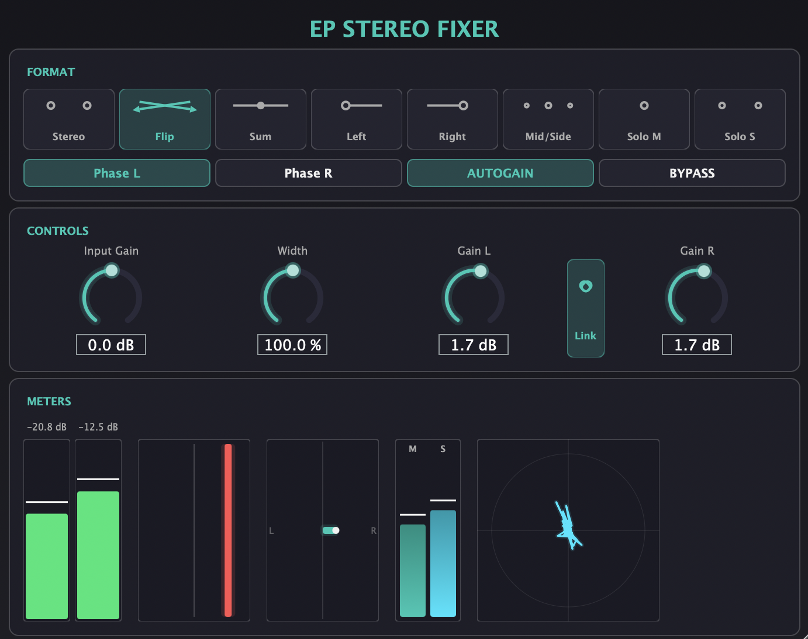

# EP STEREO FIXER

[](https://github.com/elnathproject/EP-STEREO-FIXER/actions/workflows/build.yml)

A JUCE-based stereo field manipulation plugin (VST3 / Standalone) inspired by the DaVinci Resolve Stereo Fixer panel. Designed for mixing, mastering and post-production workflows where precise stereo control is needed.

**Developer:** EP | **Category:** Fx | Spatial



---

## Features

### Format Modes

Eight exclusive modes for stereo signal routing:

| Mode | Description |
|------|-------------|
| **Stereo** | Standard stereo passthrough |
| **Flip** | Swap left and right channels |
| **Sum L+R** | Mono sum on both outputs |
| **Left** | Left channel on both outputs |
| **Right** | Right channel on both outputs |
| **Mid/Side** | M/S encode; Gain L controls Mid, Gain R controls Side |
| **Solo Mid** | Output only the Mid component |
| **Solo Side** | Output only the Side component |

### Controls

- **Input Gain** — trim the level before format processing (-18 to +18 dB)
- **Width** — stereo width via Mid/Side scaling (0% = mono, 100% = normal, 200% = extra wide)
- **Gain L / Gain R** — output gain per channel (-18 to +18 dB)
- **Link** — locks both output gain knobs together
- **Phase L / Phase R** — invert polarity of each channel (linked automatically in mono modes)
- **Auto Gain** — peak-based automatic level compensation
- **Bypass** — bypass all processing

### Meters

- **Peak meters (L/R)** — vertical bars with gradient (green/yellow/red), peak hold and dB readout
- **Phase meter** — correlation indicator (left = mono, right = out-of-phase)
- **Stereo Balance** — horizontal bar showing L/R balance
- **Mid/Side levels** — dual vertical bars showing Mid and Side signal levels
- **Stereo Goniometer** — X/Y scope of the stereo image
- **Frequency Correlometer** — 12-band phase correlation display (40 Hz – 16 kHz), green = correlated, red = out-of-phase

### GUI

- Custom look and feel with teal/cyan accent colour scheme
- Dark theme with rounded section panels (Format, Controls, Meters)
- Resizable window (default 700x670, up to 2x)
- English tooltips on all controls

---

## Requirements

- **CMake** 3.16 or later
- **C++17** compiler (Clang, GCC, MSVC)
- **JUCE** framework — https://github.com/juce-framework/JUCE

## Build

Clone JUCE anywhere on disk, then point `JUCE_DIR` to it:

```bash
export JUCE_DIR="$HOME/JUCE"
cd EP-STEREO-FIXER

cmake -B build -DCMAKE_BUILD_TYPE=Release
cmake --build build --config Release
```

### Platform Notes

| Platform | Notes |
|----------|-------|
| **macOS (Apple Silicon)** | Add `-DCMAKE_OSX_ARCHITECTURES=arm64` to the configure step |
| **macOS (Intel)** | Add `-DCMAKE_OSX_ARCHITECTURES=x86_64` |
| **macOS (Universal)** | Add `-DCMAKE_OSX_ARCHITECTURES="arm64;x86_64"` |
| **Windows** | Use Visual Studio 2019+ or MinGW with CMake |
| **Linux** | Install ALSA and X11 dev packages (`libasound2-dev`, `libx11-dev`, etc.) |

## Outputs

After building, binaries are in `build/EPStereoFixer_artefacts/Release/`:

- `VST3/EP STEREO FIXER.vst3`
- `Standalone/EP STEREO FIXER.app` (macOS) or `.exe` (Windows)

## Installation

### macOS

```bash
cp -R "build/EPStereoFixer_artefacts/Release/VST3/EP STEREO FIXER.vst3" \
    "$HOME/Library/Audio/Plug-Ins/VST3/"
```

### Windows

Copy `EP STEREO FIXER.vst3` to `C:\Program Files\Common Files\VST3\`

### Linux

Copy `EP STEREO FIXER.vst3` to `~/.vst3/`

After installing, restart your DAW or run a VST3 re-scan.

---

## Technical Details

- All gain parameters are smoothed to avoid zipper noise
- Auto Gain uses peak-based AGC with smooth decay to prevent pumping
- Phase controls are automatically linked in mono formats (Sum, Left, Right, Solo Mid)
- Mid/Side meter computes levels from the output signal in real time
- Stereo balance is computed as a smoothed ratio of L/R amplitudes

## Download

Pre-built binaries for macOS (arm64, x86_64), Windows and Linux are available on the [Releases](https://github.com/elnathproject/EP-STEREO-FIXER/releases) page.

### Creating a release

Tag a version and push — GitHub Actions will build all platforms and create the release automatically:

```bash
git tag v1.0.0
git push origin v1.0.0
```

## License

See [LICENSE](LICENSE) for details.
